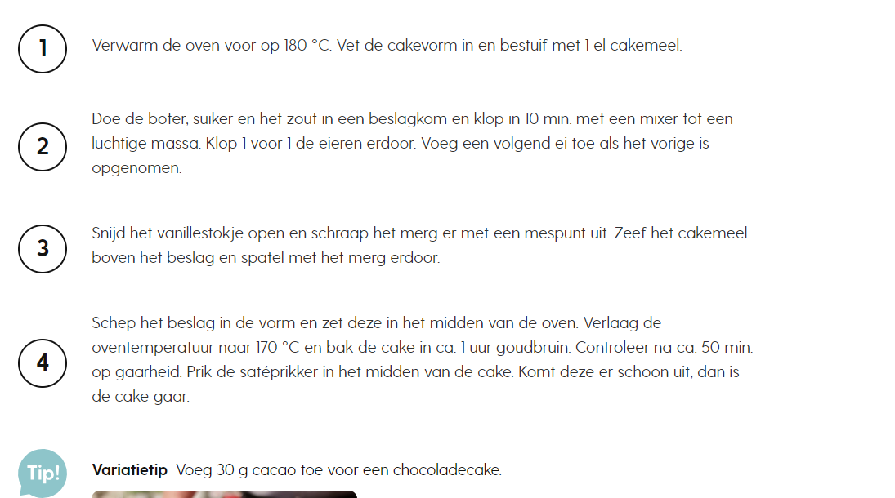

# Cake basisrecept

## BENODIGHEDEN
- 250 g cakemeel

- 250 g ongezouten roomboter

- 250 g fijne kristalsuiker

- 1 mespunt zout

- 5 middelgrote scharreleieren

- 1 vanillestokje

### BEREIDING
1 Verwarm de oven voor op 180 °C. Vet de cakevorm in en bestuif met 1 el cakemeel.

2 Doe de boter, suiker en het zout in een beslagkom en klop in 10 min. met een mixer tot een luchtige massa. Klop 1 voor 1 de eieren erdoor. Voeg een volgend ei toe als het vorige is opgenomen.

3 Snijd het vanillestokje open en schraap het merg er met een mespunt uit. Zeef het cakemeel boven het beslag en spatel met het merg erdoor.

4 Schep het beslag in de vorm en zet deze in het midden van de oven. Verlaag de oventemperatuur naar 170 °C en bak de cake in ca. 1 uur goudbruin. Controleer na ca. 50 min. op gaarheid. Prik de satéprikker in het midden van de cake. Komt deze er schoon uit, dan is de cake gaar.

variatietip Voeg 30 g cacao toe voor een chocoladecake.

[bron](https://www.ah.nl/allerhande/recept/R-R803628/cake-basisrecept)